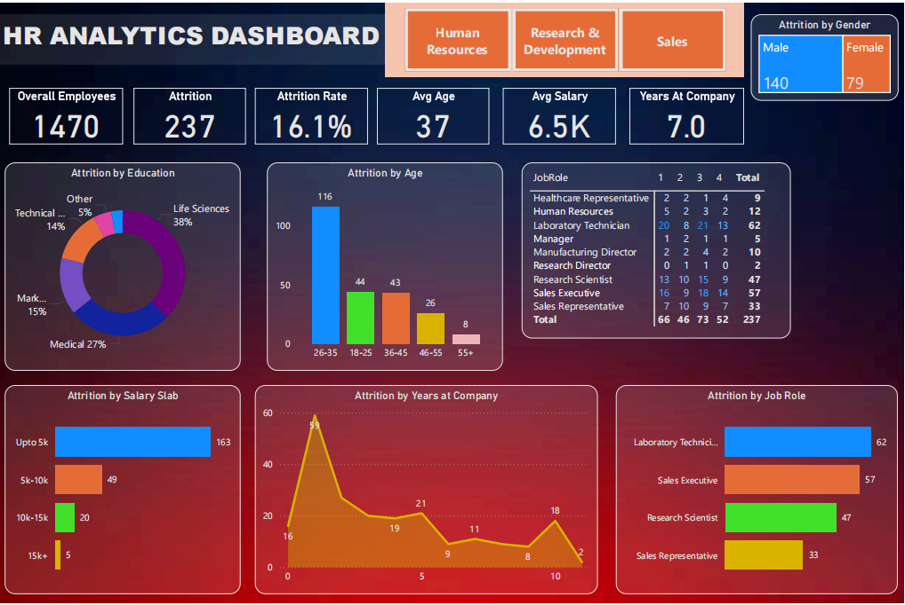

# HR Analytics Dashboard (Power BI)

## 🔍 Key Insights

Analysis of 1,470 employees revealed:

| Insight | Finding |
|---------|---------|
| **Age 26-35** | 116 left - 49% of all attrition |
| **Lowest paid** | 163 employees earning <5K left (69% of attrition) |
| **Laboratory Technicians** | 62 left - highest by role |
| **Sales Executive** | 57 left - second highest |

### Top 3 Problem Areas:
1. **Age group 26-35** accounts for nearly half of all departures
2. **Low salary bracket** (<5K) drives 69% of attrition
3. **Lab Technicians + Sales Executives** = 50% of role-based attrition

## 📊 Dashboard Features

- Total employee count: 1,470
- Attrition: 237 (16.1%)
- Average age: 37 years
- Average salary: 6.5K
- Average years at company: 7.0

### Interactive Filters
- Attrition by: Age Group | Job Role | Education | Salary | Gender
- Department-wise slicing

## 🛠️ Tools Used

- Power BI (DAX, Power Query)
- Excel

## 🎯 Business Value

This dashboard helps HR leaders:
- Identify high-attrition departments and roles BEFORE problems escalate
- Target retention efforts by age, salary, and job role
- Replace manual tracking with data-driven decisions

## 📸 Dashboard Preview

## 🔗 Links

- [GitHub Repository](https://github.com/bharati-jain/HR_Analytics_Dashboard.git)
